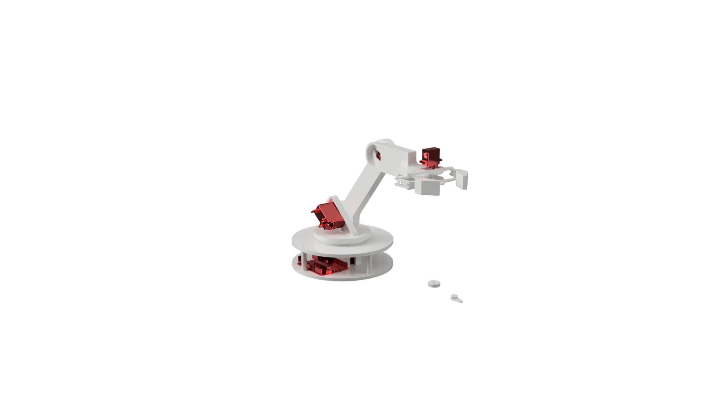
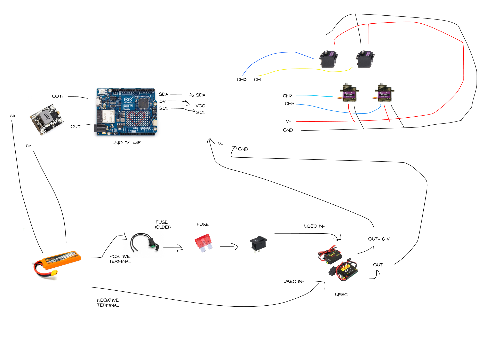
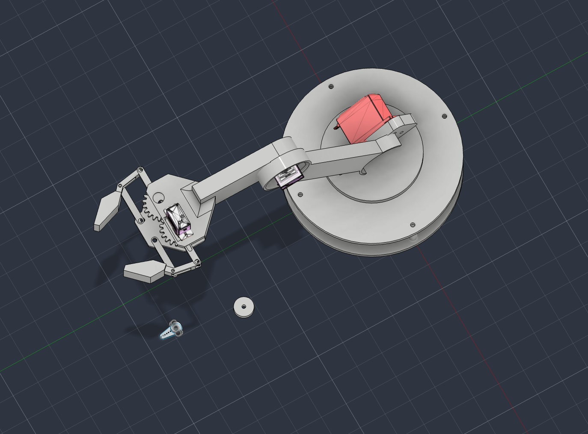
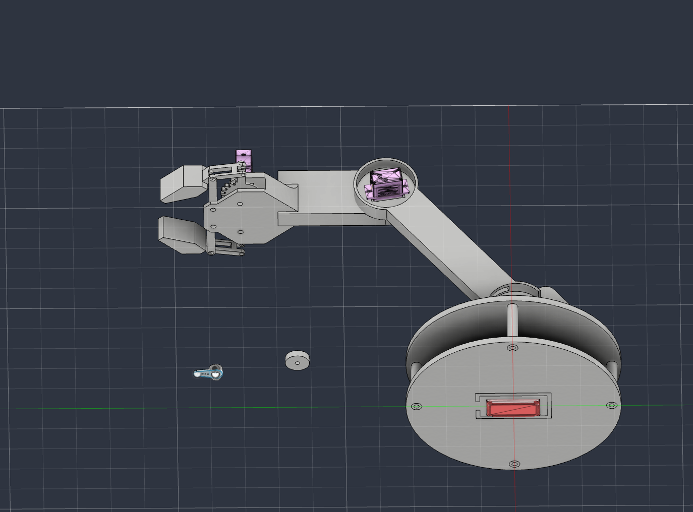
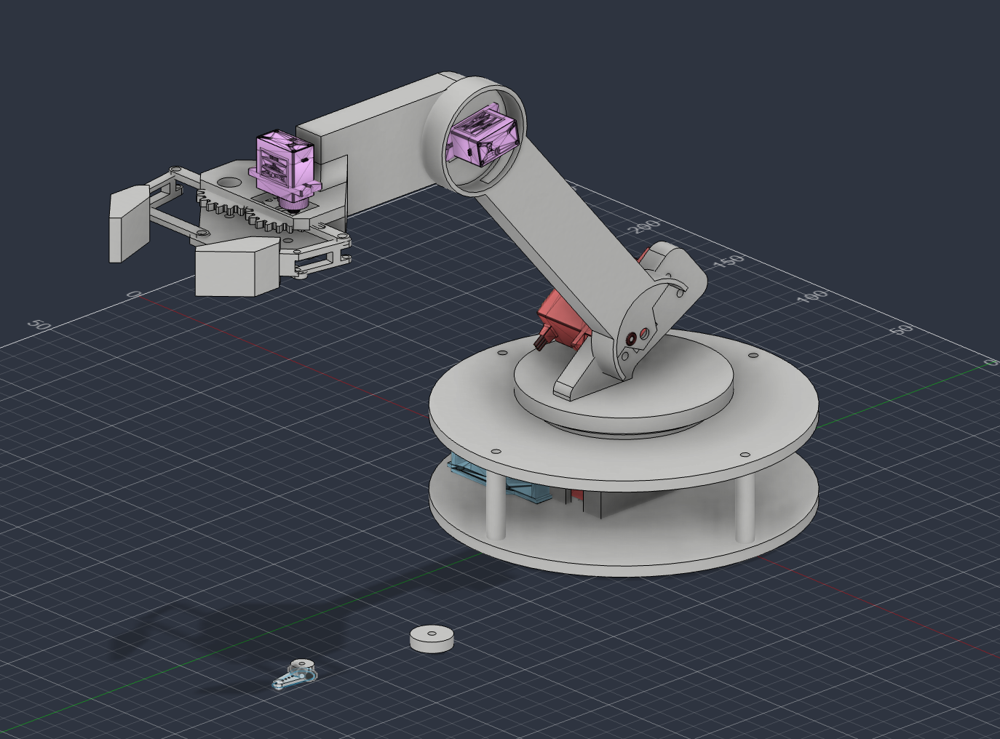

<h1 align="center">
  turnt
   
</h1>

<h4 align="center">
    4 dof robotic arm with turntable base
</h4>

## it features:

- 4 degrees of freedom: base rotation, shoulder, elbow, wrist
- MG996R servos for base/shoulder (high torque), SG90 servos for elbow/wrist
- ~15–20 cm planar reach-and-grasp workspace

## design

**base** has a circular turntable with bearing balls (1/8" balls) for smooth rotation, MG996R servo is housed within the turntable mechanism.

**shoulder & elbow** uses a MG996R for higher-torque lifting, while the elbow uses an SG90.

**wrist & gripper** rotation is driven by an SG90.

## wiring

## CAD

| top view                           | bottom view                              |
| ---------------------------------- | ---------------------------------------- |
|  |  |

| side view                         |
| --------------------------------- |
|  |

## BOM

the complete bill of materials is available in [`bom.csv`](bom.csv).
